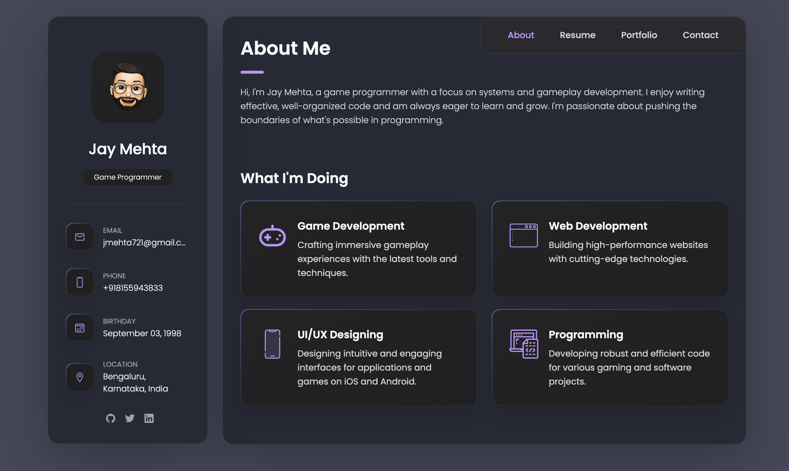

# My Personal Portfolio

This is my personal portfolio website, fully responsive and built using HTML, CSS, and JavaScript.

## Demo




## Prerequisites

Before you begin, ensure you have met the following requirements:

* [Git](https://git-scm.com/downloads "Download Git") must be installed on your operating system.

## Installing 

To install and set up the portfolio on your local machine, follow these steps:

Linux and macOS:

```bash
sudo git clone https://github.com/jaymehta721/Jay-personal-portfolio.git
```

Windows:

```bash
git clone https://github.com/jaymehta721/Jay-personal-portfolio.git
```

## Contact

If you want to contact me you can reach me at [Linkedin](https://www.linkedin.com/in/jaymehta721/).


## Credits

This portfolio template was originally created by [codewithsadee](https://github.com/codewithsadee). You can find the original project [here](https://github.com/codewithsadee/vcard-personal-portfolio).
